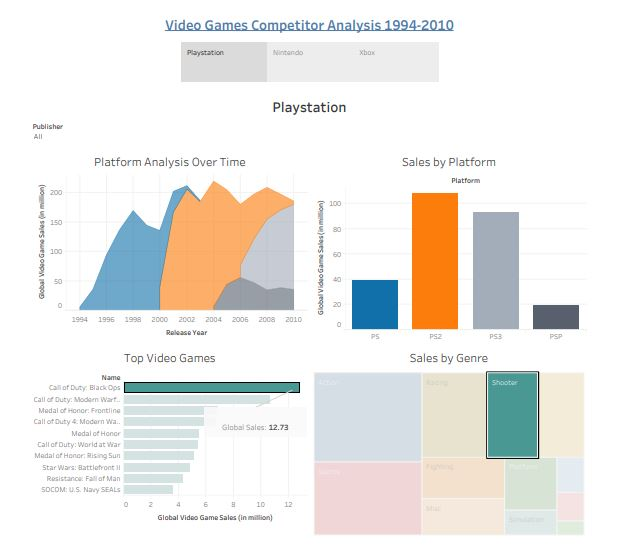
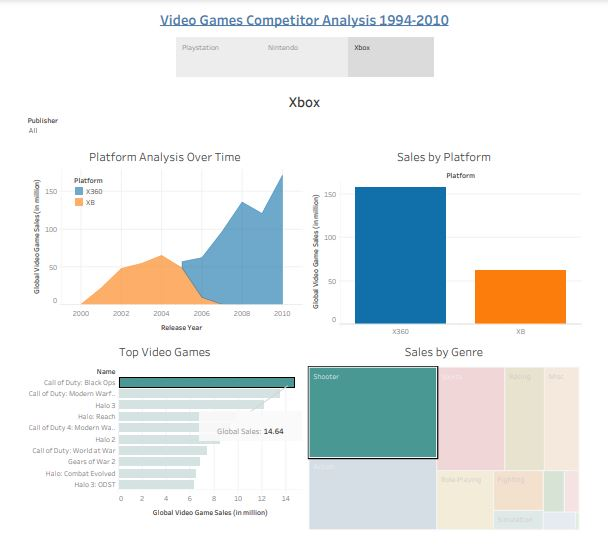
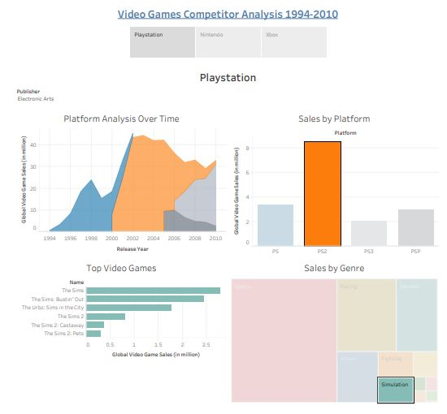

# Video-Games-Competitor-Analysis-1994-2010
Using video games sales dataset 1994-2010 to visualize with a story and find answers to some questions 

Using the Video Games - Sales to visualize, make dashboards and find:

Q1.The best-selling "Shooter" on both the "Playstation (PS)" and "Xbox" was "Call of Duty: Black Ops". On which platform did it have the highest sales? "Playstation" or "Xbox"?

Ans: Xbox

Q2.What was the name of the best-selling "Playstation 2 (PS2)" game published by "Electronic Arts" in the "Simulation" genre?
Ans: The Sims 

